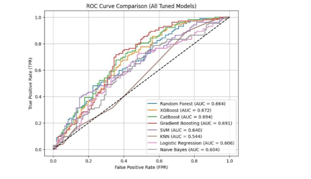
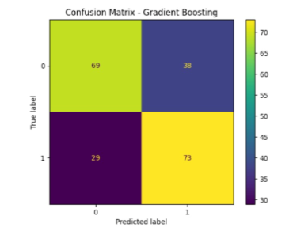
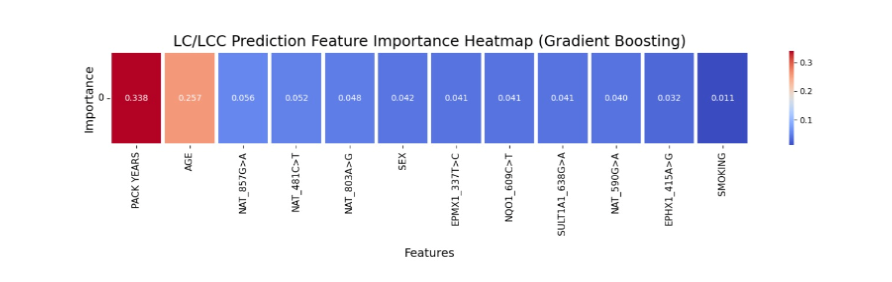

# Cancer-prediction-model
Machine learning models for lung cancer risk and histological subtype prediction using SNP biomarkers and clinical features.
# Lung Cancer Risk Prediction using Machine Learning and SNP Biomarkers

## Project Overview

This project explores the use of supervised machine learning algorithms for predicting lung cancer risk and histological subtypes using Single Nucleotide Polymorphism (SNP) biomarkers together with clinical features.

The study compares multiple machine learning models to identify the most effective algorithm for disease prediction and to determine the genetic and clinical features that contribute most significantly to prediction performance.

This project was completed as part of a B.Tech Biotechnology Capstone Project.

---

## Objectives

- Predict lung cancer susceptibility using SNP and clinical data.
- Compare the performance of multiple supervised machine learning algorithms.
- Identify important genetic and clinical biomarkers contributing to disease prediction.
- Evaluate model performance using standard classification metrics.

---

## Dataset

The dataset consisted of anonymized SNP polymorphism data together with clinical information including:

- Age
- Sex
- Smoking Status
- Pack Years
- NAT Gene Variants
- NQO1
- SULT1A1
- EPHX1
- EPMX1

**Note:**  
The dataset used in this project was provided by our academic supervisor for educational and research purposes. It is **not included** in this repository due to data-sharing restrictions.

---

## Machine Learning Models Implemented

The following classification algorithms were implemented and evaluated:

- Random Forest
- XGBoost
- CatBoost
- Gradient Boosting
- Support Vector Machine (SVM)
- Logistic Regression
- K-Nearest Neighbours (KNN)
- Gaussian Naive Bayes

---

## Project Workflow

Dataset Collection

↓

Data Preprocessing

↓

Feature Encoding

↓

Train-Test Split

↓

Model Training

↓

Prediction

↓

Performance Evaluation

↓

Feature Importance Analysis

---

## Repository Structure

```
Lung-Cancer-SNP-Prediction/

│── notebooks/
│     ├── Cancer_Prediction.ipynb
│     ├── ADCC_Prediction.ipynb
│     ├── SQCC_Prediction.ipynb
│     └── SCLC_Prediction.ipynb
│
│── poster.pdf
│── README.md
│── requirements.txt
```

---

## Technologies Used

- Python
- Google Colab
- Pandas
- NumPy
- Scikit-learn
- XGBoost
- Matplotlib
- Excel

---

## Model Evaluation Metrics

The models were evaluated using:

- Accuracy
- Precision
- Recall
- F1 Score
- ROC-AUC

---

## ROC Curve


---

## Confusion Matrix


---

## Feature Importance Heatmap


---
## Key Findings

- Ensemble learning methods consistently outperformed traditional machine learning algorithms.
- Random Forest and XGBoost achieved the strongest predictive performance across multiple classification tasks.
- Clinical variables such as Smoking Status, Pack Years and Age were among the most influential predictors.
- Several SNP polymorphisms from NAT, NQO1, SULT1A1 and EPHX1 genes also showed significant predictive importance.

---

## Results

The repository contains implementations for:

- Overall Lung Cancer Prediction
- Adenocarcinoma (ADCC) Prediction
- Squamous Cell Carcinoma (SQCC) Prediction
- Small Cell Lung Cancer (SCLC) Prediction

Performance varies depending on the classification task and dataset subset.

---

## Future Improvements

- Validate models on larger multi-center datasets.
- Perform external validation using publicly available genomic datasets.
- Hyperparameter optimization using Bayesian Optimization.
- Develop an interactive web application for prediction.
- Explore deep learning approaches for genomic classification.

---

## Contributors

This project was completed as part of a four-member team.

- Prachi Vij
- Aastha Goel
- Parul Syal
- Samriddhi Mahajan

**Project Mentor:**  
Dr. Siddharth Sharma

---

## Disclaimer

This repository is intended solely for educational and academic portfolio purposes.

The dataset is not distributed because it was provided by the course instructor for academic use and redistribution is not permitted.

---

## License

This repository is released under the MIT License unless stated otherwise.
